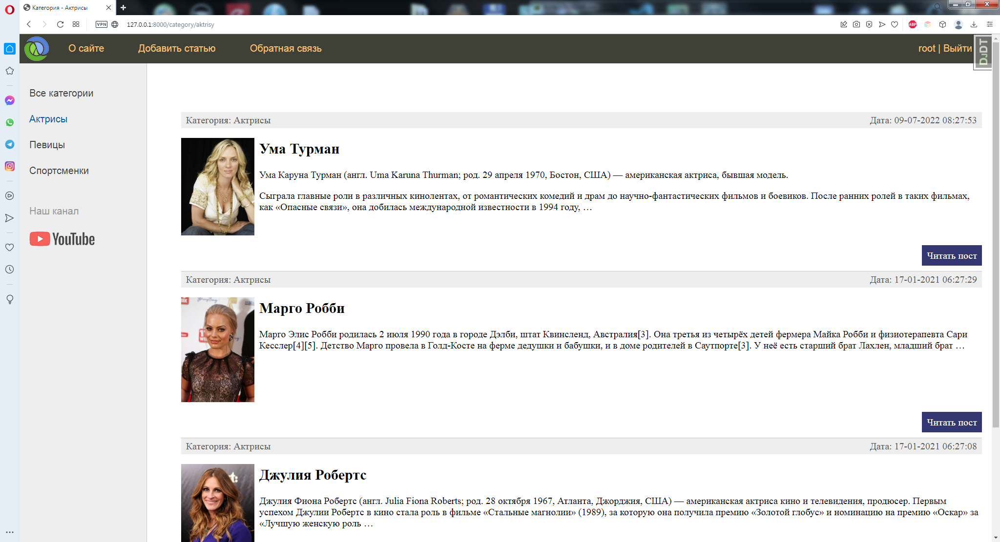

# Educational project in Django
A site that I made, repeating after the course teacher. Posted on github as a way to upload to the server for further learning how to work with the server.

### Project structure
The structure is standard for the Django framework.

### Hosting
I have upload the site to the hosting pythonanywhere.com.

You can <a href="http://alexpod.pythonanywhere.com">visit the site</a> until Friday 21 October 2022.

### Site appearance
Screenshot of one of the pages of the site:

   
